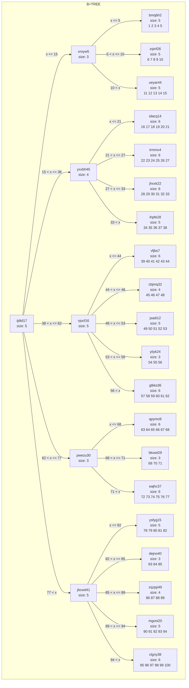

```mermaid
graph TD
subgraph B+TREE
ijdtd17[ijdtd17<br/>size: 5<br/>]
xroyw5[xroyw5<br/>size: 3<br/>]
bmqbh2[bmqbh2<br/>size: 5<br/>1 2 3 4 5 ]
xroyw5-->|x <= 5|bmqbh2
zqinf26[zqinf26<br/>size: 5<br/>6 7 8 9 10 ]
xroyw5-->|5 < x <= 10|zqinf26
ueyar44[ueyar44<br/>size: 5<br/>11 12 13 14 15 ]
xroyw5-->|10 < x|ueyar44
ijdtd17-->|x <= 15|xroyw5
yxxbh45[yxxbh45<br/>size: 4<br/>]
idacq14[idacq14<br/>size: 6<br/>16 17 18 19 20 21 ]
yxxbh45-->|x <= 21|idacq14
trmmx4[trmmx4<br/>size: 6<br/>22 23 24 25 26 27 ]
yxxbh45-->|21 < x <= 27|trmmx4
jhxxk22[jhxxk22<br/>size: 6<br/>28 29 30 31 32 33 ]
yxxbh45-->|27 < x <= 33|jhxxk22
ihpfe28[ihpfe28<br/>size: 5<br/>34 35 36 37 38 ]
yxxbh45-->|33 < x|ihpfe28
ijdtd17-->|15 < x <= 38|yxxbh45
vjocf16[vjocf16<br/>size: 5<br/>]
vfjbs7[vfjbs7<br/>size: 6<br/>39 40 41 42 43 44 ]
vjocf16-->|x <= 44|vfjbs7
cbjmq32[cbjmq32<br/>size: 4<br/>45 46 47 48 ]
vjocf16-->|44 < x <= 48|cbjmq32
jsadi12[jsadi12<br/>size: 5<br/>49 50 51 52 53 ]
vjocf16-->|48 < x <= 53|jsadi12
yiiyk24[yiiyk24<br/>size: 3<br/>54 55 56 ]
vjocf16-->|53 < x <= 56|yiiyk24
gtkks36[gtkks36<br/>size: 6<br/>57 58 59 60 61 62 ]
vjocf16-->|56 < x|gtkks36
ijdtd17-->|38 < x <= 62|vjocf16
pwezu30[pwezu30<br/>size: 3<br/>]
qpymo9[qpymo9<br/>size: 6<br/>63 64 65 66 67 68 ]
pwezu30-->|x <= 68|qpymo9
bkowt29[bkowt29<br/>size: 3<br/>69 70 71 ]
pwezu30-->|68 < x <= 71|bkowt29
eajhc37[eajhc37<br/>size: 6<br/>72 73 74 75 76 77 ]
pwezu30-->|71 < x|eajhc37
ijdtd17-->|62 < x <= 77|pwezu30
jbcwd41[jbcwd41<br/>size: 5<br/>]
ysfyg15[ysfyg15<br/>size: 5<br/>78 79 80 81 82 ]
jbcwd41-->|x <= 82|ysfyg15
dejno40[dejno40<br/>size: 3<br/>83 84 85 ]
jbcwd41-->|82 < x <= 85|dejno40
zqzpp49[zqzpp49<br/>size: 4<br/>86 87 88 89 ]
jbcwd41-->|85 < x <= 89|zqzpp49
mgoni20[mgoni20<br/>size: 5<br/>90 91 92 93 94 ]
jbcwd41-->|89 < x <= 94|mgoni20
clgny38[clgny38<br/>size: 6<br/>95 96 97 98 99 100 ]
jbcwd41-->|94 < x|clgny38
ijdtd17-->|77 < x|jbcwd41
end
```

```mermaid
graph LR
subgraph UNORDERED_HEAP
nwlrb1[nwlrb1<br/>size: 4<br/>19 82 68 21 ]
aywzk3[aywzk3<br/>size: 4<br/>24 10 89 62 ]
nwlrb1-->aywzk3
xesow6[xesow6<br/>size: 4<br/>17 38 37 27 ]
aywzk3-->xesow6
txsny8[txsny8<br/>size: 4<br/>93 58 45 26 ]
xesow6-->txsny8
ifhwu10[ifhwu10<br/>size: 4<br/>49 96 46 48 ]
txsny8-->ifhwu10
evluw11[evluw11<br/>size: 4<br/>77 12 56 36 ]
ifhwu10-->evluw11
zyoib13[zyoib13<br/>size: 4<br/>15 54 18 73 ]
evluw11-->zyoib13
zfxbi18[zfxbi18<br/>size: 4<br/>47 5 83 51 ]
zyoib13-->zfxbi18
gajwk19[gajwk19<br/>size: 4<br/>100 99 63 39 ]
zfxbi18-->gajwk19
gndmo21[gndmo21<br/>size: 4<br/>11 28 79 40 ]
gajwk19-->gndmo21
ehvhb23[ehvhb23<br/>size: 4<br/>90 87 53 2 ]
gndmo21-->ehvhb23
qembc25[qembc25<br/>size: 4<br/>69 4 70 33 ]
ehvhb23-->qembc25
qtuvh27[qtuvh27<br/>size: 4<br/>29 35 67 23 ]
qembc25-->qtuvh27
opact31[opact31<br/>size: 4<br/>16 44 55 98 ]
qtuvh27-->opact31
qfmka33[qfmka33<br/>size: 4<br/>32 74 20 31 ]
opact31-->qfmka33
tthka34[tthka34<br/>size: 4<br/>61 22 71 86 ]
qfmka33-->tthka34
onmcl35[onmcl35<br/>size: 4<br/>8 57 72 94 ]
tthka34-->onmcl35
wddio39[wddio39<br/>size: 4<br/>80 92 6 41 ]
onmcl35-->wddio39
peyzo42[peyzo42<br/>size: 4<br/>50 76 30 34 ]
wddio39-->peyzo42
qeqzn43[qeqzn43<br/>size: 4<br/>91 59 14 7 ]
peyzo42-->qeqzn43
nhlwu46[nhlwu46<br/>size: 4<br/>60 64 43 78 ]
qeqzn43-->nhlwu46
ahvef47[ahvef47<br/>size: 4<br/>13 42 97 85 ]
nhlwu46-->ahvef47
atjyt48[atjyt48<br/>size: 4<br/>65 84 1 88 ]
ahvef47-->atjyt48
mktmm50[mktmm50<br/>size: 4<br/>52 9 66 25 ]
atjyt48-->mktmm50
nljmo51[nljmo51<br/>size: 4<br/>75 3 81 95 ]
mktmm50-->nljmo51
end
```
